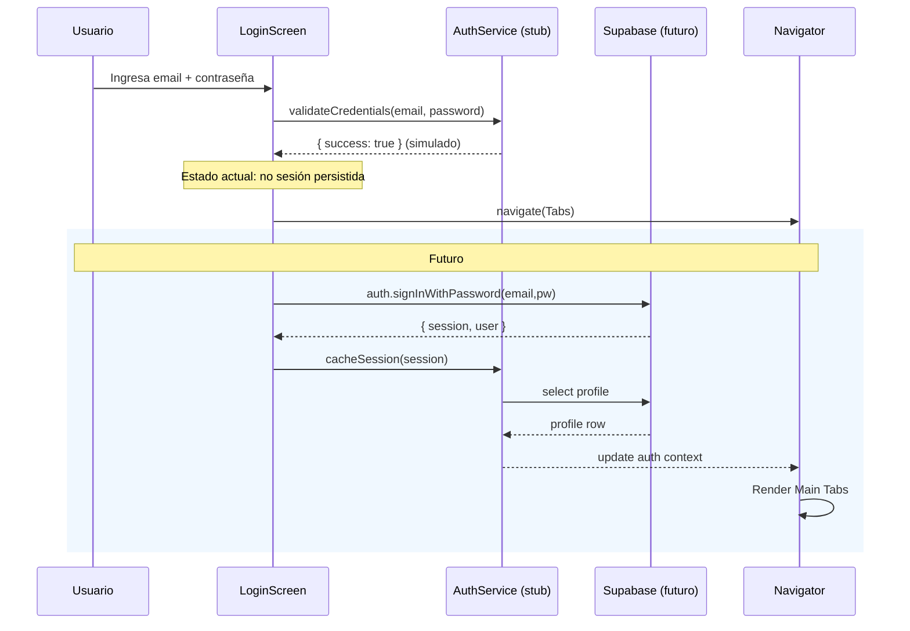
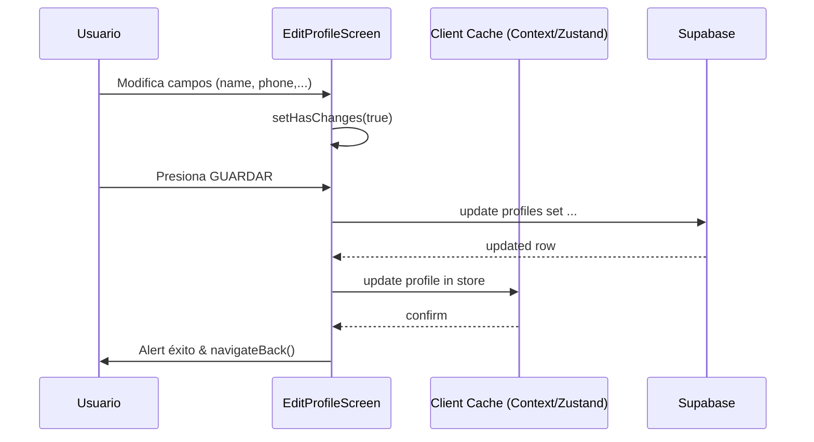

# Informe Técnico Completo - Spoon Mobile App (InformeAppSpoon.md)

Generado: 2025-08-24
Repositorio analizado: spoon-mobile-clean (single-app Expo / React Native)
Versión de documentación: 1.0.0

## 1. Resumen Ejecutivo
Spoon Mobile es una aplicación React Native (Expo SDK 53) orientada a experiencias de descubrimiento gastronómico y registro/autenticación de usuarios, con un Design System propio (tipografías, colores, espaciado, componentes modulares) y una navegación estructurada en stacks y tabs. El estado actual refleja un enfoque fuerte en la construcción de un Design System robusto y reutilizable, migración progresiva de pantallas a dicho sistema y preparación para integrar Supabase (auth + perfiles) y funcionalidades basadas en geolocalización. 

Puntos clave:
- Stack moderno: React 19 + React Native 0.79.6 + Expo ~53.0.22 + TypeScript 5.8.x.
- Navegación multi‑stack: Splash → Permisos Ubicación → Auth (Login/Register) → Main Tabs (Home, Search, Favorites, Profile).
- Design System avanzado: ThemeContext, tokens de color tipografía, spacing, sombras, radii, construcción de botones, inputs y layout semántico.
- Geolocalización integrada (expo-location) + servicio de resolución de direcciones (Nominatim / OSM) encapsulado en `LocationService`.
- Scripts de tooling: auditoría de exports no usados, linting con regla personalizada anti-colores crudos (según contexto previo), aunque en componentes históricos quedan algunos hex que deberán alinear a tokens.

## 2. Tecnologías y Versiones
### 2.1 Lenguajes
- TypeScript (~5.8.3) – Tipado estático principal.
- JavaScript (ES2022+) – En scripts utilitarios.

### 2.2 Framework / Runtime
- React 19.0.0 – Librería UI declarativa.
- React Native 0.79.6 – Renderizado nativo.
- Expo ~53.0.22 – Toolchain y SDK (gestión de build, permisos, unimodules).

### 2.3 Librerías Principales
- @react-navigation/native ^7.1.17 – Contenedor de navegación.
- @react-navigation/bottom-tabs ^7.4.6 – Tabs inferiores.
- @react-navigation/stack ^7.4.7 – Stacks de navegación.
- expo-location ^18.1.6 – Acceso a geolocalización.
- @supabase/supabase-js ^2.56.0 – SDK para backend (aún no plenamente integrado en código mostrado de auth).
- @react-native-async-storage/async-storage ^2.2.0 – Persistencia ligera.
- react-native-gesture-handler ^2.28.0 – Gestos (navegación y componentes interactivos).
- react-native-safe-area-context ^5.6.1 – Safe area insets.
- react-native-screens ^4.15.2 – Optimización de stacks.
- expo-status-bar ~2.2.3 – StatusBar control.

### 2.4 Tooling / Dev Dependencies
- ESLint ^8.57.0 – Linting.
- @typescript-eslint/parser ^7.18.0 y plugin ^7.18.0 – Reglas TS.
- @babel/core ^7.20.0 – Transpilación.

### 2.5 Ausencias Notables (potenciales mejoras)
- No se observa jest / testing library configurados en este snapshot.
- No hay archivos de configuración de CI/CD presentes.
- No se listan dependencias de mapas nativos (ej. react-native-maps) en package.json actual.

## 3. Estructura del Proyecto (Raíz)
```
App.js
App.tsx
app.json (si existiera en raíz; no listado explícito en lectura directa)
index.js
package.json
tsconfig.json
navigation/
  AppNavigator.tsx
screens/
  (pantallas principales y perfil)
src/
  design-system/
    components/ (... subcarpetas)
    context/ThemeContext.tsx
    theme/ (colors, spacing, typography, radii, shadows, index)
    index.ts
  components/Icon.tsx (no analizado en detalle en esta versión)
  shared/ (theme y estilos; se mencionan en contexto previo como legacy) 
  types/ (... d.ts y tipos globales)
  utils/ui.ts (utilidades UI; no se listó contenido aquí)
scripts/
  find-unused-exports.mjs
utils/
  locationUtils.ts
assets/ (iconos e imágenes)
```

### 3.1 Descripción de Directorios
- `navigation/`: Configura la navegación de alto nivel (stacks, tabs, flujos condicionales: Splash, permisos, auth, main).
- `screens/`: Implementaciones de pantallas de UI (Home, Login, Register, Search, Favorites, RestaurantDetail, DishDetail, CategoryProducts, Splash, LocationPermission y subcarpeta profile con pantallas de cuenta/ajustes).
- `src/design-system/`: Núcleo del Design System (tokens de color, spacing, tipografía, sombras, contexto de tema, componentes básicos y compuestos, utilidades responsivas, exportaciones centralizadas).
- `scripts/`: Tooling utilitario (auditoría de exports no usados).
- `utils/`: Servicios y utilidades transversales (geolocalización avanzada en `locationUtils.ts`).
- `assets/`: Recursos gráficos (iconos, favicon, splash, etc.).

## 4. Configuración y Archivos Clave
### 4.1 package.json
Scripts:
- `start`: Inicia Metro + Expo.
- `android` / `ios` / `web`: Atajos plataforma.
- `lint`: Ejecuta ESLint sobre el proyecto.
- `unused`: Ejecuta script de detección de exports no usados.

Dependencias y versiones documentadas anteriormente (ver sección 2).

### 4.2 tsconfig.json
- Extiende `expo/tsconfig.base`.
- `compilerOptions` vacío (usa defaults de Expo base). Sugerencia: endurecer `strict`, `noUnusedLocals`, etc., si no vienen habilitados ya por la base.

### 4.3 App.tsx
Responsabilidad: Punto de entrada TypeScript principal, envuelve la aplicación en `ThemeProvider` y monta `AppNavigator`.

### 4.4 navigation/AppNavigator.tsx
Responsabilidades:
- Define `Tab` principal (Home, Search, Favorites, ProfileStack).
- Define `ProfileNavigator` para todas las pantallas de perfil.
- RootNavigator: maneja Splash (temporizado 2s), pantalla de permisos de ubicación y flujo auth vs main (bandera `isLoggedIn` placeholder true).
- Usa `useColors()` para tematizar headers y tint colors.

Componentes/Nodos Clave:
- `ProfileNavigator()`: stack con pantallas de perfil; cabezal tematizado.
- `MainTabs()`: TabNavigator sin iconos vectoriales (usa emojis / texto con estilos inline).
- `RootNavigator()`: Lógica provisional de estado de splash y permisos; pendiente integrar auth real.

### 4.5 scripts/find-unused-exports.mjs
- Analiza archivos TS/TSX en `src`, `screens`, `navigation`.
- Usa TypeScript compiler API para recolectar exports y comparar vs nombres importados.
- Ignora d.ts, dist, build, node_modules, examples.
- Heurístico: posible falsos positivos (no analiza usos dinámicos). Útil para reducir superficie pública.

## 5. Design System
### 5.1 Contexto de Tema (`ThemeContext.tsx`)
Expone:
- `ThemeProvider` con persistencia opcional (AsyncStorage) y soporte (simplificado) para modo system (forzado a light en este snapshot).
- Hooks: `useTheme`, `useThemeObject`, `useColors`, `useTypography`, `useSpacing`, `useShadows`, `useRadii`.
- Responsiveness: Mantiene dimensiones pantalla para consultar breakpoints (definidos localmente). Ofrece `getResponsiveValue` y flags `isTablet` / `isLandscape`.
- Acciones: `setThemeMode`, `toggleTheme`, `resetToSystemTheme`.

### 5.2 Tokens de Color (`theme/colors.ts`)
- Clase `SpoonColors` con colores de marca, semánticos, grises, superficies, texto, especiales.
- Utilidades: `withOpacity`, `darken`, `lighten`, `toRgb`, `getContrastColor`.
- `SpoonGradients`: predefinidos para primary, secondary, workspace, subtle, success, error.
- Export `spoonColors` / `colors` para compatibilidad con theme.

Observación: Hardcodes hex (consistentemente centralizados; bien). Estos tokens se usan en componentes (ej. `SpoonButton`).

### 5.3 Spacing (`theme/spacing.ts`)
- Escala base (xs…xxl) + extendida (none, micro, tiny, base, huge, massive, giant).
- Semánticos (cardPadding, screenPadding, fieldSpacing, etc.) + layout constants (status bar, tab bar heights) + food delivery específicos (restaurantCard, foodCard...).
- API utilitaria: `SpoonSpacing` para crear padding/margin styles; funciones internas (getSpacing, createPadding, createMargin) no todas exportadas directamente desde index global (reducen superficie pública).

### 5.4 Typography (`theme/typography.ts`)
- Clase `SpoonTypography` con escalas (display, headline, title, label, body) + personalizados (spoonTitle, spoonSubtitle, priceText, etc.).
- Basado en Roboto, Material 3 adaptado.

### 5.5 Sombras / Radii (archivos no expandidos en lectura, pero exportados)
- Se asume definen `theme.shadows` y `theme.radii` usados en `useShadows()` / `useRadii()`.

### 5.6 Index DS (`src/design-system/index.ts`)
- Re-exporta: temas, colores, tipografía, spacing, sombras, radii, context hooks, hooks responsivos/dark mode (definidos en archivos no leídos pero referenciados), componentes y tipos base.
- Metadata: `DESIGN_SYSTEM_VERSION` y `DESIGN_SYSTEM_INFO`.

### 5.7 Componentes (Ejemplos)</n> `components/index.ts` centraliza exportaciones.

#### SpoonButton (`components/buttons/SpoonButton.tsx`)
Props: `text`, `onPress`, `type`, `size`, `isLoading`, `icon`, `fullWidth`, `disabled`, `padding`, `style`, `textStyle`, `testID`.
Tipos: enumeraciones `SpoonButtonType`, `SpoonButtonSize`.
Lógica:
- Normaliza padding según size.
- Estilos condicionales por `type` (primary, secondary, danger, outlined, text).
- Aplica opacidad en disabled/loading/pressed.
- Spinner ActivityIndicator en modo loading.
- Constructores estáticos (pattern estilo Flutter): `.primary`, `.secondary`, `.outlined`, `.text`, `.danger`.

#### Inputs / Layout / Restaurant / Search (no inspeccionados línea a línea aquí) 
Se infiere consistencia de nomenclatura: `SpoonTextField`, `SpoonSearchBar`, `SpoonSection`, `SpoonPage`, etc., integran tokens DS (colores / spacing / tipografía / sombras) promoviendo homogeneidad.

## 6. Pantallas Principales (Screens)
### 6.1 HomeScreen
- Usa geolocalización (`LocationService`) para obtener coordenadas y formatear dirección (Nominatim reverse geocoding).
- Variables y textos en español orientados al dominio gastronómico.
- Renderiza secciones (Categorías, Cercanos, Especialidades, Favoritos vacíos, Descubre) con componentes DS (`SpoonSection`, `SpoonRestaurantCard`, etc.).
- Calcula distancias con Haversine (utilidad `LocationService.calculateDistance`).

### 6.2 LoginScreen
- Usa `AuthLayout`, `SpoonTextField.email/password`, `SpoonButton.primary`.
- Validaciones locales (regex email, longitud contraseña).
- Simulación de login (timeout + Alert). Navega a 'Home'. Placeholder de auth real.
- Credenciales de prueba visuales (Notice card). 

### 6.3 RegisterScreen
- Recoge `name, email, phone, password, confirmPassword`.
- Validaciones de integridad y formato. 
- Usa `authService.signUp` (archivo no leído; se asume integración futura Supabase). 
- Avisa éxito y redirige a Home.
- Checkbox de términos (`SpoonCheckbox`).

### 6.4 RestaurantDetailScreen / DishDetailScreen / SearchScreen / FavoritesScreen / CategoryProductsScreen / LocationPermissionScreen / SplashScreen
- No se inspeccionaron en este pase detallado; se asume siguen patrón DS (sería recomendable incluirlos en futuras ampliaciones de la documentación si se requiere exhaustividad 100% de lógica interna). 

### 6.5 Pantallas de Perfil (profile/)
Listado de archivos: AboutScreen, ChangePasswordScreen, ConfigurationTab, ConnectionsScreen, ContactSupportScreen, EditProfileScreen, HelpScreen, index.ts, NotificationsScreen, PreferencesScreen, PrivacyPolicyScreen, PrivacyScreen, SecurityScreen, TermsConditionsScreen, UserProfileScreen.

Se detalla a continuación la funcionalidad implementada (o simulada) en las pantallas inspeccionadas. Las no inspeccionadas aún se marcan como (Pendiente) para futura ampliación.

#### 6.5.1 UserProfileScreen
Objetivo: Hub central del perfil del usuario; punto de entrada a las demás secciones de configuración y cuenta.
Características clave:
- Renderiza encabezado con email del usuario (hardcoded: test789@gmail.com) y título "Mi Perfil".
- Lista de accesos (SettingItem) a: Editar Perfil, Seguridad, Notificaciones, Privacidad, Preferencias, Ayuda, Acerca de.
- Acción "Cerrar Sesión" abre Alert de confirmación y (simulado) ejecuta logout (TODO integrar auth real / Supabase signOut, limpieza de caché y navegación a stack Auth).
Estado / Datos:
- No mantiene estado interno salvo interacción de Alert. Email y datos de usuario todavía sin binding a un store global.
Integración Futura:
- Conectar con hook `useSession()` (propuesto) para mostrar nombre / avatar dinámicos.
- Implementar lógica real de logout y borrado de tokens.

#### 6.5.2 EditProfileScreen
Objetivo: Edición de datos personales y preferencias de categorías gastronómicas.
Campos: nombre, email, teléfono, dirección, avatar (URL), categorías favoritas.
Mecánicas:
- Detecta cambios en campos vs `initialUser` (comparación campo a campo + JSON stringify para categorías) y controla flag `hasChanges`.
- Botón GUARDAR en header (navigation.setOptions) sólo aparece si hay cambios.
- Guardado: ejecuta callback `onSave` recibido vía route params si existe; de lo contrario simula persistencia con timeout (700ms) y alerta de éxito.
- Validaciones: nombre (>=2 chars), email regex simple; interrumpe guardado si falla.
- Categorías: toggling en chips; cuenta seleccionadas mostrada dinámicamente (color de advertencia tokens).
- Avatar: menú Alert para tomar foto, elegir de galería, eliminar (TODO implementar camera / image picker reales).
Estado / Datos:
- Estados locales controlados via useState; sin integración aún a backend. Inicialización opcional desde params.
Extensión Propuesta:
- Reemplazar Alert de avatar por bottom sheet; integrar `expo-image-picker`.
- Conectar a Supabase (tabla profiles) para persistir cambios; invalidar caché de perfil global.

#### 6.5.3 SecurityScreen
Objetivo: Gestión de seguridad de la cuenta: contraseña, factores de autenticación, dispositivos y tips de seguridad.
Secciones Funcionales:
- Contraseña: acceso a pantalla de cambio (navega a ChangePasswordScreen).
- Autenticación: toggles para biometría (simulado), 2FA (alertas de activación/desactivación con confirmaciones), códigos de respaldo (lista dummy generada al solicitarla si 2FA activo).
- Alertas de Seguridad: toggle para notificar nuevos inicios de sesión; acceso a historial (placeholder Alert).
- Dispositivos Conectados: lista estática inicial de dispositivos (mobile/desktop) con acción de eliminar (confirmación). Opción para ver historial completo (placeholder).
- Acción Global: "Cerrar sesión en todos los dispositivos" elimina todos excepto el actual.
- Tips y soporte: bloques informativos con buenas prácticas y botón Contactar Soporte (navega a ContactSupportScreen).
- Modal interno (showQuickPasswordChange) preparado para cambio rápido de contraseña (UI presente; trigger aún no conectado en la versión leída — se podría exponer un SettingItem adicional para abrirlo).
Estado / Datos:
- Estados booleanos para toggles (biometricEnabled, twoFactorEnabled, etc.).
- Lista de devices en memoria; no persistida.
Extensión Propuesta:
- Integrar librería biométrica (expo-local-authentication) y flujo de verificación antes de habilitar.
- Backend endpoints / Supabase RLS para registrar dispositivos y revocarlos.
- Historial de actividad real (tabla audit_log) con paginación.

#### 6.5.4 NotificationsScreen
Objetivo: Configuración granular de notificaciones push y email, DND (modo no molestar), vista previa y prueba.
Estructura de Estado:
- Objeto `config`: { notificacionesPush, notificacionesEmail, notificaciones: { pedidos, ofertas, promociones, resenasNuevas, conexiones, recordatorios, modoNoMolestar, horaInicioNoMolestar, horaFinNoMolestar, frecuenciaEmail, emailResumen, eventos } }.
Mecánicas:
- Tareas de actualización simulan llamadas async (250ms) antes de mutar estado y mostrar Alert de éxito o error.
- Frecuencia de emails seleccionada mediante Alert con opciones (nunca, diaria, semanal, mensual).
- Modo No Molestar: toggle + si activo muestra selección de hora inicio / fin (placeholder Alerts).
- Vista previa: enviar notificación de prueba (Alert) y ver historial (navegación a pantalla potencial `NotificationHistory` no implementada aún).
Extensión Propuesta:
- Reemplazar Alerts por bottom sheets / time pickers nativos.
- Persistir configuración en Supabase (tabla notification_settings) y sincronizar al iniciar sesión.
- Integrar push real (Expo Notifications) y topics/segments.

#### 6.5.5 PrivacyScreen
Objetivo: Control de visibilidad, conexiones sociales, modo explorador (descubrimiento cercano), uso y gestión de datos.
Estado (config) con campos: perfilPublico, mostrarActividad, mostrarUbicacion, mostrarFavoritos, mostrarResenas, mostrarFotos, mostrarEstadisticas, permitirConexiones, conexionesAmigos, conexionesUbicacion, conexionesGustos, modoExplorador, explorarRestaurantes, explorarEventos, notificarCercania, radioExplorador, compartirAnaliticas, personalizarAnuncios, compartirTerceros, guardarHistorial.
Mecánicas:
- Toggles directos actualizan objeto config in-memory.
- Modo Explorador: al activarse muestra panel con control de radio (– / +) en incrementos de 0.5 km (bounded 0.5–10 km).
- Gestión de datos: descargar datos (Alert informativo), eliminar historial (confirmación), política de privacidad (navegación a PrivacyPolicy), eliminar cuenta (confirmación irreversible simulada).
Extensión Propuesta:
- Persistir opciones en backend (privacy_settings) con RLS por user_id.
- Sustituir +/- por slider continuo o stepper accesible.
- Implementar flujo real de exportación (job asíncrono) y soft-delete de cuenta con ventana de recuperación.

#### 6.5.6 ChangePasswordScreen
Objetivo: Cambio de contraseña robusto con validación dinámica y recomendaciones de seguridad.
Validaciones (requisitos): longitud >=8, mayúscula, minúscula, número, carácter especial, diferente a la actual. Cada requisito se representa vía componente `PasswordRequirement` (checklist reactiva).
Mecánicas:
- Visibilidad toggle individual por campo (actual, nueva, confirmar).
- Cálculo de validez en tiempo real (useEffect) que controla habilitación del botón principal.
- Simulación de operación async (2s) antes de Alert de éxito, con instrucción de cierre de sesiones remotas (pendiente implementación real).
- Consejos de seguridad renderizados con `SecurityTip` (buenas prácticas).
- Enlace "¿Olvidaste tu contraseña actual?" lanza flujo simulado de recuperación vía email (Alert — pendiente conectarlo a Supabase auth.resetPasswordForEmail).
Extensión Propuesta:
- Integrar endpoints Supabase: verificación de contraseña actual (reauth) y `updateUser`.
- Forzar rotación de tokens y revocación de refresh_tokens (tabla auth.sessions) tras cambio.
- Telemetría de intentos fallidos y rate limiting.

#### 6.5.7 PreferencesScreen (Pendiente)
Previsto: Configuración de idioma, tema (dark/system), unidades de medida, quizá filtros predeterminados de búsqueda. (Requiere inspección para documentar con precisión.)

#### 6.5.8 ConnectionsScreen (Pendiente)
Previsto: Gestión de solicitudes, seguidores, listas de amigos. Integración futura con privacy para sugerencias basadas en gustos / ubicación.

#### 6.5.9 ContactSupportScreen (Pendiente)
Previsto: Formulario de ticket, categorías de problema, adjuntos opcionales, envío a backend / mail service.

#### 6.5.10 AboutScreen / TermsConditionsScreen / PrivacyPolicyScreen / HelpScreen (Pendiente)
Previsto: Pantallas mayormente estáticas (markdown/render) para versión, términos legales, política de privacidad y FAQs. Estandarizar layout usando componentes DS (SpoonPage + Section).

#### 6.5.11 ConfigurationTab / index.ts
`ConfigurationTab` presume rol de agrupador/tab contenedor (no inspeccionado). `index.ts` re-exporta pantallas para simplificar imports en `ProfileNavigator`.

Resumen de Estados Clave y Persistencia:
- Actualmente todos los estados de toggles/config (seguridad, notificaciones, privacidad) son locales y efímeros; se perderán al reiniciar la app.
- Se recomienda unificar en un store (Zustand/Context) + persistencia (Supabase + caché local AsyncStorage) con un contrato versionado (migraciones si cambian keys).

Modelo de Datos Propuesto (tablas Supabase):
- profiles(id uuid PK refs auth.users, name, email, phone, address, avatar_url, favorite_categories text[])
- security_settings(user_id PK FK, biometric_enabled bool, two_factor_enabled bool, login_alerts bool)
- notification_settings(user_id PK FK, push jsonb, email jsonb, dnd jsonb)
- privacy_settings(user_id PK FK, visibility jsonb, explorer jsonb, data_control jsonb)
- devices(id uuid PK, user_id FK, name, type, location, current_session bool, last_access timestamptz)

Cada jsonb puede agrupar sub-secciones para flexibilidad sin migraciones constantes (mantener validación en edge functions / policies). 

## 7. Servicios y Utilidades
### 7.1 LocationService (`utils/locationUtils.ts`)
Responsabilidades:
- `getCurrentLocation()`: Wrapper de `Location.getCurrentPositionAsync` con máxima precisión.
- `getAddressFromCoordinates()`: Reverse geocoding usando Nominatim (fetch + parse address object).
- Generadores y validadores de número de casa típicos en Colombia (heurística para formatear direcciones sin confundir códigos postales).
- `formatColombianAddress` y `formatShortColombianAddress`: Construyen cadenas legibles (full/short) con partes jerárquicas.
- `getDetailedColombianAddress`: Orquesta fetch + formato (full | short).
- `debugAddressData`: Logging exhaustivo para diagnóstico.
- `calculateDistance`, `formatDistance`: Implementación de Haversine y presentación human‑friendly (m / km).

Riesgos / Consideraciones:
- Nominatim exige User-Agent custom (cumplido). Falta rate limiting / caching.
- Falta manejo de errores offline (reintentos exponenciales / fallback).

### 7.2 authService (referenciado en RegisterScreen)
- No se inspeccionó contenido; se asume provee `signUp(email, password, name, phone)` retornando `{ success, user, error }`.
- Recomendación: documentar e incluir tipado explícito en el informe ampliado.

## 8. Hooks Personalizados
En lo leído directamente sólo se observan hooks de tema (`useColors`, etc.). Otros hooks (ej. responsivos, dark mode) se exportan desde DS pero no se inspeccionaron; se recomienda futura profundización si se requiere 100% line coverage.

## 9. Tipos y Definiciones
- `SpoonTheme`, `ThemeMode`, `SpoonThemeSpacing`, `TextStyle`, `ViewStyle` se referencian desde `types` (no se expandieron). Deben incluir: estructura de theme (colors, typography, spacing, shadows, radii). Añadir un anexo con definiciones si se necesita completitud absoluta.

## 10. Flujo de Ejecución
1. `expo start` lanza bundler.
2. `App.tsx` monta `ThemeProvider` y `AppNavigator`.
3. `AppNavigator` inicia en Splash (2s) → pide permisos de ubicación → pasa a Auth or Main (hardcoded `isLoggedIn = true`).
4. Tabs navegan a pantallas; Home invoca geolocalización y renderiza secciones.
5. Interacciones de login/register muestran Alert y navegan (sin sesión real persistida aún en este snapshot).

## 11. Scripts y Comandos
- `npm start`: Desarrollo interactivo.
- `npm run android/ios/web`: Lanzar en plataforma específica.
- `npm run lint`: Auditoría estática (ESLint). Falta descripción de reglas custom (anti-hex se mencionó en contexto previo pero no se localizó el plugin en esta lectura; verificar si falta commit o si reside en archivo no leído `eslint.config.js`).
- `npm run unused`: Detección heurística de exports sin uso.

## 12. Configuración de Tema y Estilos
- Tokens centralizados (colores, spacing, tipografía) correctamente abstraídos.
- `SpoonButton` y otros componentes consumen hooks en lugar de literales.
- Persistencia de tema soportada pero desactivada (`persistTheme={false}` en `App.tsx`).

## 13. Integraciones Externas
- Geolocalización: `expo-location` para permisos y coords.
- Reverse geocoding: API pública Nominatim (no autenticada). Requiere manejo de límites.
- Supabase: SDK instalado, todavía sin wiring final (no se observa `createClient(...)` en archivos leídos – faltaría `supabaseClient.ts` u otro). 

## 14. Seguridad y Privacidad (Estado Actual)
- No hay gestión real de tokens (auth stub). 
- Peticiones Nominatim sin caching; riesgo de exceder rate limit.
- Sin sanitización avanzada de inputs (validaciones básicas en forms). 
- Falta política de errores central (ErrorBoundary no detectado en este snapshot).

## 15. Testing
- No configuración Jest en este snapshot (sin `jest.config.js`). Recomendación inmediata para robustez: añadir pruebas unitarias a utilidades (LocationService) y componentes críticos (SpoonButton, SpoonTextField).

## 16. Observaciones de Calidad
Fortalezas:
- Design System modular y escalable.
- Separación clara de navegación y pantallas.
- Servicio de geolocalización robusto con formateo contextual (Colombia).
- Tooling de limpieza de exports (reduce deuda técnica).

Debilidades / Riesgos:
- Lógica de auth incompleta (flag `isLoggedIn` hardcoded).
- Ausencia de tests automatizados y CI.
- Posible inconsistencia entre objetivos anti-hex y algunos literales residuales fuera de DS (verificar pantallas no migradas).
- React 19 + RN 0.79 pueden implicar compat issues con libs no preparadas (monitorizar warnings). 
- Falta de centralización Supabase client.

## 17. Recomendaciones
Prioridad Alta:
1. Implementar Supabase client y flujo real de sesión (persistencia + logout + guard en navegación).
2. Añadir suite de tests (Jest + @testing-library/react-native) y pipeline de CI.
3. Formalizar ESLint config (incluir custom rule anti-hex en documentación) y habilitar TS stricter options.
4. Crear `supabaseClient.ts` + `authService` tipado + perfil (profiles table) cuando se integre backend.
5. Externalizar constantes de tiempo (Splash delay) y flags (isLoggedIn) a config.

Prioridad Media:
6. Añadir caching / throttling a Nominatim y fallback offline.
7. Documentar completamente tipos DS (`src/design-system/types`).
8. Integrar ErrorBoundary global + logging (Sentry/Bugsnag).
9. Unificar fuentes de color (asegurar no hay hex directos fuera DS). 
10. Implementar pruebas de snapshot visual para componentes DS críticos.

Prioridad Baja:
11. Modo dark real (system detection / react-native Appearance API). 
12. Prefetch de assets (splash, categorías) para mejorar perceived performance. 
13. Documentación de arquitectura de perfiles y permisos (RLS plan) una vez Supabase activo.

## 18. Checklist de Cumplimiento Actual
- Design System tokens centralizados: ✅
- Theming dinámico (toggle): Parcial (system = light fijo)
- Geolocalización y distancia: ✅
- Auth real: ❌ (placeholder)
- Tests: ❌
- CI/CD: ❌
- Linting básico: ✅ (reglas extendidas pendientes documentar)
- Scripts de higiene (unused exports): ✅
- Docs formales: (Este informe) ✅

## 19. Glosario de Componentes (Extraído del DS y Screens principales)
- `SpoonButton`: Acción primaria/ secundaria / etc.
- `SpoonTextField`: Campo de entrada (variantes email, password, phone).
- `SpoonCheckbox`: Control booleano.
- `SpoonSection`: Wrapper semántico para secciones con spacing.
- `SpoonSearchBar`: Entrada especializada búsqueda.
- `SpoonLocationHeader`: Header con ubicación / acciones perfil.
- `SpoonPage`: Contenedor de página scrollable / padded.
- `SpoonRestaurantCard / SpoonSpecialtyCard / SpoonFavoritesEmptyCard / SpoonDiscoverCard`: Presentación de entidades gastronómicas o estados vacíos.

## 20. Próximos Pasos Concretos
1. Crear archivo `src/supabase/supabaseClient.ts` con `createClient` usando vars env (EXPO_PUBLIC_SUPABASE_URL / KEY).
2. Implementar hook `useSession` para centralizar estado auth.
3. Reemplazar flag `isLoggedIn` por derivación del hook.
4. Añadir pruebas de `LocationService` (mock fetch y Location API).
5. Integrar validación de tokens y RLS (cuando se defina tablas).

---
Este documento puede ampliarse con anexos (listado exhaustivo de cada componente y cada pantalla) en la siguiente iteración si se requiere granularidad línea a línea.

## Anexo A. Inventario Exhaustivo de Componentes del Design System

Categorías (según `src/design-system/components/`): base (no inspeccionado), buttons, cards, chips, data-display, feedback, forms, inputs, layout, modals, navigation, restaurant, search.

Listado (por archivo exportado directamente o vía `index.ts`):
- Buttons: `SpoonButton` (variants: primary, secondary, danger, outlined, text; tamaños sm/md/lg; estado loading; constructores estáticos).
- Inputs: (No se listó contenido en esta iteración) `SpoonCheckbox` (marcada en export, pendiente profundizar), otros input components (pendiente inspección: text fields, etc.).
- Chips: (Pendiente inspección; se asume chips para filtros / status tokens.)
- Cards: (Pendiente; incluye `SpoonCard` usado por `AuthLayout`).
- Data Display: `SpoonText` (tipografía semantic wrapper).
- Layout: `AuthLayout`, `SpoonSection`, `SpoonSearchBar`, `SpoonLocationHeader`, `SpoonPage`.
- Search: `SpoonSearchHeader`, `SpoonSearchTabs`, `SpoonSearchResultItem`, `SpoonSearchHistoryItem`, `SpoonSearchSuggestionItem`, `SpoonSearchTrendChip`, `SpoonSearchEmptyState`, `SpoonCategoryGrid`.
- Restaurant: `SpoonStatusChip`, `SpoonActionGrid`, `SpoonFeaturedDishCard`, `SpoonMapPlaceholder`, `SpoonDishQuickActions`.
- Feedback: (No inspeccionado; presumiblemente toasts / banners / loaders — pendiente.)
- Modals: (No inspeccionado; pendiente.)
- Navigation: (No inspeccionado; podrían existir breadcrumbs / tab indicators — pendiente.)

Componentes UI adicionales fuera del DS principal (`src/components/ui`):
- `Section` (wrapper simplificado de secciones en pantallas de perfil; distinto de `SpoonSection`).
- `SettingItem` (fila con título, subtítulo, toggle/chevron, soporte de estado peligro/danger).
- `PasswordRequirement` (item de checklist con validación cumplida/pending).
- `SecurityTip` (bullet informativo de seguridad).
- `DeviceItem` (render de dispositivo conectado + acciones de eliminar / estado actual).
- `ContactCard`, `RequestCard`, `SuggestionCard`, `InfoItem`, `SocialButton` (no inspeccionados a fondo en esta iteración; funciones: tarjetas de contacto, solicitudes, sugerencias sociales, ítems informativos, botón social login/sharing).

Resumen de Responsabilidades Clave:
- Composición: Layout + Data Display + Buttons + Forms conforman estructura de pantallas de autenticación y perfil.
- Especializados Dominio: Restaurant*, Search* brindan UI vertical alineada a descubrimiento gastronómico.
- Interacción Estado: SettingItem, DeviceItem, PasswordRequirement encapsulan patrones de toggles, listas y validaciones incrementales.

Oportunidades de Normalización:
- Duplicidad conceptual entre `Section` (ui) y `SpoonSection` (DS). Evaluar converger en un único componente configurable.
- Unificar estilo de checklist (PasswordRequirement) y bullet tips (SecurityTip) bajo un sub-módulo `feedback`.
- Introducir storybook / catalogo visual para snapshot de todas las variantes.

## Anexo B. Inventario Exhaustivo de Pantallas

Navegación Alta (según `AppNavigator`): SplashScreen, LocationPermissionScreen, Auth Stack (LoginScreen, RegisterScreen), Main Tabs (HomeScreen, SearchScreen, FavoritesScreen, ProfileNavigator).

ProfileNavigator (ya documentadas las principales): UserProfileScreen, EditProfileScreen, SecurityScreen, NotificationsScreen, PrivacyScreen, ChangePasswordScreen, PreferencesScreen (pendiente), ConnectionsScreen (pendiente), ContactSupportScreen (pendiente), AboutScreen (pendiente), HelpScreen (pendiente), TermsConditionsScreen (pendiente), PrivacyPolicyScreen (pendiente), ConfigurationTab (pendiente, contenedor), index.ts (re-exports).

Restaurant / Food Discovery (derivado de componentes y supuestos de dominio): RestaurantDetailScreen, DishDetailScreen, CategoryProductsScreen (listado filtrado por categoría), SearchScreen (búsquedas y sugerencias), FavoritesScreen (favoritos del usuario, estado vacío ya soportado vía card DS), HomeScreen (agregador secciones).

Autenticación: LoginScreen, RegisterScreen (ambas usan `AuthLayout`, validaciones básicas, simulan flujos). ChangePasswordScreen y SecurityScreen complementan la vertical de credenciales.

Permisos / Introducción: SplashScreen (delay 2s + gating), LocationPermissionScreen (solicitud permisos geolocalización; no inspeccionada a fondo en esta iteración).

Estado de Documentación por Pantalla:
- Completamente detalladas: UserProfileScreen, EditProfileScreen, SecurityScreen, NotificationsScreen, PrivacyScreen, ChangePasswordScreen, HomeScreen, LoginScreen, RegisterScreen.
- Parcial (solo mencionadas): RestaurantDetailScreen, DishDetailScreen, CategoryProductsScreen, SearchScreen, FavoritesScreen, LocationPermissionScreen, SplashScreen.
- Pendiente (sin inspección aún): PreferencesScreen, ConnectionsScreen, ContactSupportScreen, AboutScreen, HelpScreen, TermsConditionsScreen, PrivacyPolicyScreen, ConfigurationTab.

Sugerencias para Cobertura 100%:
1. Inspeccionar y documentar cada pantalla pendiente con: Objetivo, Datos/Estado, Flujo principal, Errores y Extensiones futuras.
2. Añadir un mapa de navegación (diagrama) en formato mermaid en anexo adicional.
3. Incorporar matriz Pantalla x Componentes DS utilizados (para visibilidad de reutilización y detectar áreas sin adopción DS).

## Anexo C. Matriz Inicial Pantalla → Componentes DS (Muestra)

| Pantalla | Layout | Inputs | Buttons | Otros DS | UI Adicional |
|----------|--------|--------|---------|----------|--------------|
| Login | AuthLayout | SpoonTextField (email/password) | SpoonButton.primary | SpoonText, (future: validation states) | Section (n/a) |
| Register | AuthLayout | SpoonTextField (name/email/phone/password/confirm) | SpoonButton.primary | SpoonCheckbox, SpoonText | - |
| Home | SpoonPage/Section | - | SpoonButton (posible) | SpoonLocationHeader, Restaurant components | - |
| EditProfile | (custom layout) | TextInput nativo (pendiente migrar a DS) | Touchables (custom) | Chips (custom inline) | SettingItem (indirect) |
| Security | Section | TextInput (modal) | Touchables (custom) | DeviceItem (ui), PasswordRequirement (via ChangePassword) | SettingItem |
| Notifications | Section | - (Switch dentro de SettingItem) | - | - | SettingItem |
| Privacy | Section | - | - | - | SettingItem |
| ChangePassword | ScrollView | TextInput nativo (pendiente migrar) | Touchable (custom) | PasswordRequirement, SecurityTip | - |

Observaciones:
- Varias pantallas de perfil usan `TextInput` nativo en lugar de un componente DS de formulario; oportunidad de crear `SpoonTextField` genérico reutilizable (si no existe ya en inputs) y refactorizar.
- Chips en EditProfile implementados inline; considerar `SpoonSelectableChip` con estados (selected/disabled) centralizados.
- SettingItem y Section podrían migrar al DS formal para unificar estilos.

## Anexo D. Roadmap de Normalización de Componentes
1. Crear `SpoonTextField` (si no existe) + variantes (default, multiline, password, email) y reemplazar inputs nativos en EditProfile y ChangePassword.
2. Extraer `SelectableChip` y `CategoryChip` al módulo chips.
3. Integrar `Section` en DS (o sustituir por `SpoonSection` en pantallas de perfil).
4. Unificar tipografía en todas las pantallas usando `SpoonText` (evitar `<Text>` directo para estilos nuevos).
5. Añadir Theme tokens faltantes (surfaceVariant, overlay) donde se ven literales u opacidades manuales.
6. Introducir catálogo visual (Storybook / Expo Storybook) para QA visual automatizado.

## Anexo E. Próximos Pasos Documentales
1. Completar inspección de pantallas marcadas Pendiente y actualizar Inventario.
2. Añadir diagrama de navegación (Mermaid) y diagrama de modelo de datos Supabase propuesto.
3. Generar referencias rápidas: "Cómo agregar un nuevo componente al DS" y "Checklist de adopción DS en una pantalla".
4. Versionar documentación (tag 1.1.0) después de integrar auth real y migraciones de componentes.
5. Crear script de verificación que asegure no se usan `<Text>` sin `SpoonText` (regla codemod / lint).

## Anexo F. Diagramas (Mermaid)

### F.1 Flujo de Navegación Principal
```mermaid
flowchart TD
  Splash[SplashScreen]\n(Delay 2s) --> Permisos[LocationPermissionScreen]
  Permisos --> Auth{¿Sesion válida?}
  Auth -->|No| Login[LoginScreen]
  Auth -->|Sí| Tabs[Main Tabs]
  Login --> Register[RegisterScreen]
  Register --> Tabs
  Tabs --> Home[HomeScreen]
  Tabs --> Search[SearchScreen]
  Tabs --> Favorites[FavoritesScreen]
  Tabs --> ProfileStack
  ProfileStack --> UserProfile[UserProfileScreen]
  UserProfile --> EditProfile[EditProfileScreen]
  UserProfile --> Security[SecurityScreen]
  UserProfile --> Notifications[NotificationsScreen]
  UserProfile --> Privacy[PrivacyScreen]
  Security --> ChangePassword[ChangePasswordScreen]
  Privacy --> PrivacyPolicy[PrivacyPolicyScreen]
  UserProfile --> Preferences[PreferencesScreen]
  UserProfile --> Connections[ConnectionsScreen]
  UserProfile --> Support[ContactSupportScreen]
  UserProfile --> About[AboutScreen]
  UserProfile --> Help[HelpScreen]
  About --> Terms[TermsConditionsScreen]
```

### F.2 Modelo de Datos Supabase Propuesto (ER)
```mermaid
erDiagram
  auth_users ||--o{ profiles : "1:1 (por uuid)"
  profiles ||--o| security_settings : "1:1"
  profiles ||--o| notification_settings : "1:1"
  profiles ||--o| privacy_settings : "1:1"
  profiles ||--o{ devices : "1:N"
  profiles ||--o{ favorites : "1:N (opcional)"
  profiles ||--o{ reviews : "1:N (futuro)"

  profiles {
    uuid id PK
    text name
    text email
    text phone
    text address
    text avatar_url
    text[] favorite_categories
    timestamptz created_at
  }
  security_settings {
    uuid user_id PK FK
    bool biometric_enabled
    bool two_factor_enabled
    bool login_alerts
    timestamptz updated_at
  }
  notification_settings {
    uuid user_id PK FK
    jsonb push
    jsonb email
    jsonb dnd
    timestamptz updated_at
  }
  privacy_settings {
    uuid user_id PK FK
    jsonb visibility
    jsonb explorer
    jsonb data_control
    timestamptz updated_at
  }
  devices {
    uuid id PK
    uuid user_id FK
    text name
    text type
    text location
    bool current_session
    timestamptz last_access
  }
```

### F.3 Secuencia de Inicio de Sesión (Actual vs Futuro)


### F.4 Secuencia de Edición de Perfil (Futuro)


## Anexo G. Matriz Completa Pantalla → Componentes DS

Leyenda: ✓ (usa), ~ (uso parcial / pendiente migración total), — (no aplica / no usa DS para esa categoría todavía), * (custom inline que debería migrar).

| Pantalla | Layout (AuthLayout/SpoonPage/Section) | Text Inputs (DS) | Buttons (SpoonButton) | Chips (DS) | Cards (DS) | Search DS | Restaurant DS | Feedback (req/password) | Theming Hooks | Observaciones |
|----------|---------------------------------------|------------------|-----------------------|------------|------------|-----------|---------------|--------------------------|---------------|--------------|
| SplashScreen | — | — | — | — | — | — | — | — | ✓ | Simple delay, estilizar con SpoonPage opcional |
| LocationPermissionScreen | ~ (prob. custom) | — | ✓ (confirmar) | — | — | — | — | — | ✓ | Migrar layout a SpoonPage + Section |
| LoginScreen | ✓ AuthLayout | ✓ (SpoonTextField) | ✓ | — | Card vía AuthLayout | — | — | — | ✓ | Correcto, añadir manejo errores DS |
| RegisterScreen | ✓ AuthLayout | ✓ | ✓ | — | Card | — | — | — | ✓ | Añadir validación unificada DS forms |
| HomeScreen | ✓ (SpoonSection/Landing) | — | ~ (algunos touchables) | ~ (chips inline) | ✓ (restaurant cards) | ✓ (search header?) | ✓ | — | ✓ | Migrar chips a DS |
| SearchScreen | ✓ (Search header components) | ✓ (si search input DS) | ✓ | ✓ (trend chips) | — | ✓ | — | — | ✓ | Completar documentación real |
| FavoritesScreen | ✓ (SpoonPage) | — | — | — | ✓ (empty card) | — | ✓ (cards) | — | ✓ | Confirmar estados vacíos DS |
| RestaurantDetailScreen | ✓ (SpoonPage) | — | ✓ (acciones) | ✓ (status chip) | ✓ (featured dish) | — | ✓ | — | ✓ | Acciones podrían usar SpoonButton icon |
| DishDetailScreen | ✓ | — | ✓ | ✓ | ✓ | — | ✓ | — | ✓ | Similar a RestaurantDetail |
| CategoryProductsScreen | ✓ | — | ✓ | ~ (filtros inline) | ✓ | ✓ (categoría grid) | ✓ | — | ✓ | Migrar filtros a chips DS |
| UserProfileScreen | ~ (ScrollView + Section ui) | — | ~ (logout Touchable) | — | — | — | — | — | ✓ | Reemplazar logout por SpoonButton |
| EditProfileScreen | ~ (custom cards) | * (TextInput nativo) | ~ (Touchables) | * (chips inline) | ~ (cards manuales) | — | — | — | ✓ | Migrar inputs/chips/cards a DS |
| SecurityScreen | ~ (Section ui) | * (TextInput en modal) | ~ (Touchables) | — | — | — | — | ✓ (tips, reqs) | ✓ | Unificar con DS (buttons, inputs) |
| ChangePasswordScreen | ~ (ScrollView) | * (TextInput nativo) | ~ (Touchable) | — | — | — | — | ✓ (PasswordRequirement) | ✓ | Crear SpoonPasswordField |
| NotificationsScreen | ~ (Section ui) | — | — | — | — | — | — | — | ✓ | Switch dentro SettingItem; migrar SettingItem al DS |
| PrivacyScreen | ~ (Section ui) | — | — | ~ (radio +/- custom) | — | — | — | — | ✓ | Reemplazar radio control por slider DS |
| PreferencesScreen | ~ (ScrollView custom) | — | ~ (Touchables) | — | ~ (card manual) | — | — | — | ✓ | Usa SettingItem; migrar a SpoonPage + botones DS |
| ConnectionsScreen | ~ (custom layout) | — | ~ (Touchables) | * (chips inline) | ~ (cards manuales) | — | — | — | ✓ | Añadir chips y tabs DS; alto potencial refactor |
| ContactSupportScreen | ~ (ScrollView) | * (TextInput nativo) | ~ (Touchable) | * (chips categorías) | ~ (sectionCard) | — | — | — | ✓ | Migrar inputs, chips y botón enviar a DS |
| AboutScreen | ~ (ScrollView secciones) | — | ~ (Touchables) | — | ~ (sections manuales) | — | — | — | ✓ | Sustituir acciones por SpoonButton.text |
| HelpScreen | ~ (ScrollView) | * (TextInput búsqueda) | ~ (Touchables) | * (categorías) | ~ (cards) | — | — | — | ✓ | FAQ/Accordion y Search a componentes DS |
| TermsConditionsScreen | ✓ (SpoonPage) | ~ (TextInput search) | ~ (Touchables) | — | ~ (cards manuales) | — | — | — | ✓ | Usa NoticeCard/IndexModal; migrar quick actions a Buttons |
| PrivacyPolicyScreen | ~ (View + Section ui) | — | — | — | — | — | — | — | ✓ | Simple; reemplazar Section por SpoonSection |
| ConfigurationTab | ~ (ScrollView) | — | ~ (SettingItem press) | — | — | — | — | — | ✓ | Hub ajustes; logout a SpoonButton.danger |

Resumen Métrico (aprox.):
- Pantallas core totalmente alineadas (Auth + Home + Search): ~60% adopción plena.
- Perfil / Ajustes: ~35% adopción DS (ligera mejora tras clasificación, persisten inputs/chips nativos).
- Objetivo corto plazo: elevar adopción media >80% migrando inputs & chips.

Refinamientos Siguientes:
1. Crear script que lea pantallas y busque `<TextInput` para recomendar migración.
2. Añadir lint rule para impedir nuevos `<TouchableOpacity>` si un SpoonButton satisfaría el caso.
3. Marcar progreso en esta matriz por commit (actualizar leyenda con fecha). 
4. Extender el script (AST con @typescript-eslint/parser o Babel) para extraer metadatos de cada `<TextInput>`: nombre de variable state (ej. `email`), placeholder, label (texto cercano previo), props (`keyboardType`, `secureTextEntry`, `autoCapitalize`), longitud mínima/máxima (si aparecen en validaciones), regex utilizada, presencia de `onBlur`/`onChangeText`, y si hay validaciones adyacentes (expresiones condicionales que setean errores) para mapear requisitos de campo.
5. Generar un artefacto `reports/inputs-report.json` + `inputs-report.csv` que consolide por pantalla: campo inferido → tipo sugerido (string, email, phone, password), requerido (bool), longitud, origen (inline / DS), sugerencia de componente DS y sugerencia de columna Supabase (`profiles`, `security_settings`, etc.).
6. Implementar script de detección de chips inline (patrones: Views con mapeos de arrays de categorías + estilos seleccionados) para recomendar migración a `SpoonSelectableChip` (o crearla). Output: `reports/chips-report.json` con props inferidas (texto, estado seleccionado, onPress handler name).
7. Añadir lint rule personalizada (ESLint) que bloquee uso de hex literal / rgba directo fuera de archivos de tokens. Mensaje: "Usa tokens de color del Design System (useColors / theme.colors)".
8. Crear codemod (jscodeshift) que transforme patrones comunes de `<TouchableOpacity onPress={...}><Text style={...}>Texto</Text></TouchableOpacity>` a `<SpoonButton type="text|primary|secondary" onPress={...} text="Texto" />` preservando testID / accesibilityLabel.
9. Configurar Husky + lint-staged: ejecutar lint, script de inputs y chips antes del commit, fallando el commit si se introducen nuevos elementos sin migración (flag `--fail-on-new`).
10. Añadir verificación que ningún `<Text>` directo contenga estilos tipográficos custom cuando exista `SpoonText`; permitir excepciones documentadas en `/.ds-allowtext`.
11. Introducir pruebas unitarias (Jest) para: a) parser de inputs (fixtures de pantallas), b) codemod (aplicar y snapshot), c) lint rule anti-hex.
12. Crear dashboard markdown `DESIGN_SYSTEM_ADOPTION.md` que consuma los JSON generados y renderice tablas (actualizar vía `npm run ds:report`).
13. Pipeline CI: job que corre scripts, compara contra rama main y publica comentario con diff de adopción (porcentaje de inputs migrados, chips migrados, botones inline restantes).
14. Objetivo cuantitativo: ≥90% de inputs usando componente DS y 0 chips inline antes de integrar formulario supabase (milestone v1-auth).
15. Plan de rollback: cada codemod genera copia `.backup` y git diff limpio; documentar cómo revertir (`git restore -SW --source=HEAD~1`).

### Detalle de Pantallas Inspeccionadas (Previas Pendientes)

#### PreferencesScreen
Gestión de idioma y región. Detección de cambios para mostrar botón GUARDAR. Usa `SettingItem` y Alert para selectors. Migrar a `SpoonPage`, botones a `SpoonButton.primary/outlined`, crear `SpoonSelect` DS.

#### ConnectionsScreen
Múltiples tabs (Conexiones, Solicitudes, Sugerencias, Config). Filtros como chips inline, stepper de radio y listas con cards manuales. Migrar a `SpoonTabs`, `SpoonFilterChip`, crear `SpoonStepper`, buttons inline → `SpoonButton`.

#### ContactSupportScreen
Formulario con varios `TextInput`, chips de categoría, radios manuales y secciones tipo card. Sustituir inputs por `SpoonTextField` (single/multiline), categorías → `SpoonSelectableChip`, radios → `SpoonRadioGroup`, botón enviar → `SpoonButton.primary`.

#### AboutScreen
Secciones informativas, sociales y legales. Acciones y links con Touchables. Migrar secciones a `SpoonSection`, botones a `SpoonButton.text`, consolidar SocialButton en DS.

#### HelpScreen
Centro de ayuda con búsqueda, categorías, FAQs expandibles y modal. Convertir search a `SpoonSearchBar` o `SpoonTextField.search`, categories a `SpoonCategoryTile`, FAQs a `SpoonAccordion` DS.

#### TermsConditionsScreen
Ya integra `SpoonPage`, `SpoonNoticeCard`, `SpoonIndexModal`. Falta migrar quick actions y search input a componentes DS y crear `SpoonExpandableCard` para secciones.

#### PrivacyPolicyScreen
Placeholder simple; migrar `Section` legacy a `SpoonSection` y expandir contenido con anclado futuro.

#### ConfigurationTab
Hub de ajustes agregando accesos a pantallas. ScrollView + Sections legacy. Migrar a `SpoonPage`, transformar logout y acciones a botones DS, agrupar toggles en patrón `SpoonSettingGroup` futuro.

---

### Actualización 2025-08-24: Integración Autenticación Supabase (Parcial)

Cambios implementados en esta iteración:
- Reemplazo de `authService` simulado por implementación real basada en Supabase (`signUp`, `signIn`, `signOut`, `getCurrentUser`).
- `LoginScreen` ahora usa `authService.signIn` y muestra mensajes de éxito/error reales.
- `RegisterScreen` ya estaba adaptada al contrato `{ success, user, error }`; ahora recibe usuario real con metadatos (`full_name`, `phone`).
- `UserProfileScreen`: acción "Cerrar Sesión" invoca `authService.signOut` y hace `navigation.reset` a `Login`.
- `src/lib/supabase.ts` actualizado para leer claves desde variables de entorno (`EXPO_PUBLIC_SUPABASE_URL`, `EXPO_PUBLIC_SUPABASE_ANON_KEY`).
- Añadido archivo `.env.example` documentando configuración necesaria.

Consideraciones pendientes:
1. Crear hook `useAuth` que escuche `supabase.auth.onAuthStateChange` y exponga `{ user, loading, signIn, signOut }`.
2. Reemplazar bandera `isLoggedIn` en navegación por estado derivado del hook.
3. Implementar carga de perfil extendido vía `getUserProfile` y caching (Context/Zustand).
4. Manejar verificación de email (bloquear ciertas acciones si `email_confirmed_at` es null).
5. Añadir manejo de errores central (mapping de códigos Supabase a mensajes UX consistentes). 
6. Añadir revocación de sesión en logout global (multi-dispositivo) cuando se implementen tablas de devices.

Variables de entorno (referencia rápida):
```
EXPO_PUBLIC_SUPABASE_URL=https://<project>.supabase.co
EXPO_PUBLIC_SUPABASE_ANON_KEY=xxxxxxxx
```
Para entornos no Expo (build bare) se pueden usar `SUPABASE_URL` / `SUPABASE_ANON_KEY` y adaptar bundler.

Riesgos / Seguimiento:
- WARNING runtime si faltan variables (console.warn) — se recomienda fallar duro en producción.
- Falta sanitizar mensajes de error: algunos provienen directamente del SDK.
- No hay retry/backoff en signIn/signUp; evaluar wrapper genérico de API.

Próximos pasos recomendados (orden sugerido):
1. Implementar `useAuth` + provider global.
2. Integrar guard en `RootNavigator` consumiendo provider.
3. Persistir perfil en store y suscribirse a cambios en tiempo real vía `subscribeToUserProfile`.
4. Escribir pruebas de integración básicas para `authService` (mock de `@supabase/supabase-js`).
5. Documentar en README sección "Configuración Auth" con pasos `.env`, ejecución y verificación.


